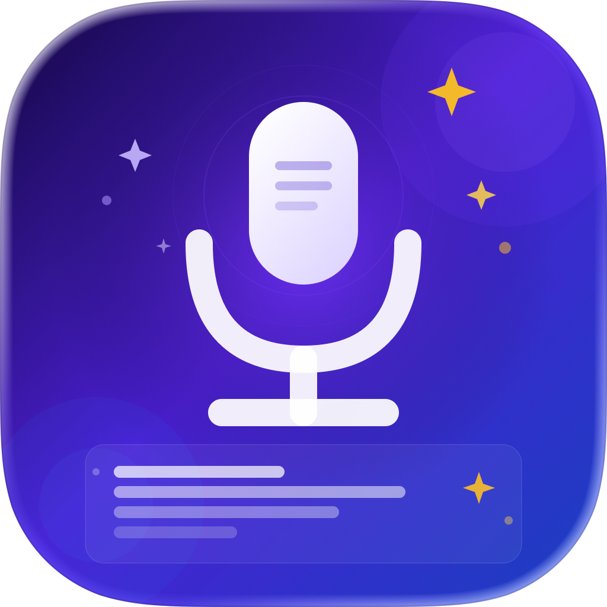

#  Hi, I'm Henry (WooSeop Lim) 
### iOS Developer who pursues "Clean Code & Scalable Architecture"

---

## 🛠 Tech Stack
- **Languages & Frameworks:** Swift, UIKit, SwiftUI, Swift Concurrency
- **Architecture:** MVVM, MVC, Clean Architecture, ReactorKit, TCA (Learning)
- **Library & Tools:** RxSwift, SnapKit, Tuist, SPM, CoreData, SwiftData, Firebase
- **Others:** Git Flow, CI/CD (GitHub Actions), Unit Testing

---

## 📱 서비스 진행중

###  [Photi (포티)](https://apps.apple.com/kr/app/%ED%8F%AC%ED%8B%B0/id6747941953) | *Team Project*
> **실시간 사진 인증 챌린지 커뮤니티**
- **Tech:** `UIKit`, `Tuist`, `RxSwift`, `Swift Concurrency`, `MVVM`
- **Focus:**
  - **Tuist**를 도입하여 프로젝트 설정 자동화 및 모듈 간 의존성 관리 최적화.
  - **Swift Concurrency**를 활용해 비동기 이미지 처리 및 UI 응답성 개선.
  - 코드 기반 UI(`SnapKit`)로 디자인 디테일 및 유지보수 효율 확보.
- [GitHub Repository](https://github.com/alloon-project/photi-ios)

---

## 🚀 출시 예정

###  MeetAgent | *Personal Project*
> **음성 녹음 & AI 자동 요약 앱**
- **Tech:** `SwiftUI`, `SwiftData`, `Apple Speech Framework`, `Apple Foundation Model`, `Clean Architecture`
- **Focus:**
  - **Apple Speech(SFSpeechRecognizer)** 기반 완전 온디바이스 실시간 STT 구현 — 외부 모델 다운로드 없이 즉시 사용 가능.
  - **50초 세션 선제 재시작** 전략으로 Apple Speech 1분 제한을 우회, 무제한 연속 녹음 지원.
  - **Apple Foundation Model** 활용 온디바이스 AI 요약 — 강의·회의·계약 모드별 맞춤 마크다운 형식 출력.
  - **Clean Architecture** (Presentation / Domain / Data) + **SOLID 원칙** 적용으로 계층 간 의존성 역전 및 확장성 확보.
  - Voice Processing IO로 배경음·에코 제거, 8개 언어 STT 지원.

---

## 🗄️ 서비스 및 지원 종료

###  [DIVIDE (디바이드)](https://apps.apple.com/kr/app/divide/id6464589963) | *Team Project*
> **배달 공동 주문 플랫폼**
- **Tech:** `UIKit`, `MVVM`, `NaverMap SDK`, `RxSwift`
- **Focus:**
  - 실시간 위치 기반 서비스 구현을 위한 외부 SDK 연동 및 최적화.
  - MVVM 패턴을 적용하여 복잡한 주문 로직과 UI 상태의 결합도 분리.

###  [MoMo (Memory Moment)](https://apps.apple.com/kr/app/%EB%AA%A8%EB%AA%A8-memorymoment/id1668532366)
> **심플한 메모 및 일기 기록 앱**
- **Tech:** `UIKit`, `MVC`, `CoreData`, `SnapKit`
- **Focus:** 로컬 DB(`CoreData`)를 활용한 오프라인 데이터 영속성 관리 및 경량화된 아키텍처 설계.

---

## ✍️ Records & Links
- 📝 [Technical Blog](https://blog.naver.com/wcbe9745) : 개발 중 마주한 트러블슈팅과 CS 지식을 기록합니다.
- 📂 [Resume (Notion)](https://lemona-97.notion.site/iOS-Developer-5d5745226a0246a2a0ebb3d2e1e3e6db) : 상세한 경력과 프로젝트 경험을 확인하실 수 있습니다.
- 📫 Contact : wcbe9745@naver.com

---

## 💡 Interest
- **Better Architecture:** 복잡한 앱의 상태를 효율적으로 관리하기 위한 **TCA**와 **ReactorKit** 연구 중.
- **Optimization:** 메모리 누수 방지(ARC)와 앱 실행 성능 최적화에 깊은 관심이 있습니다.
